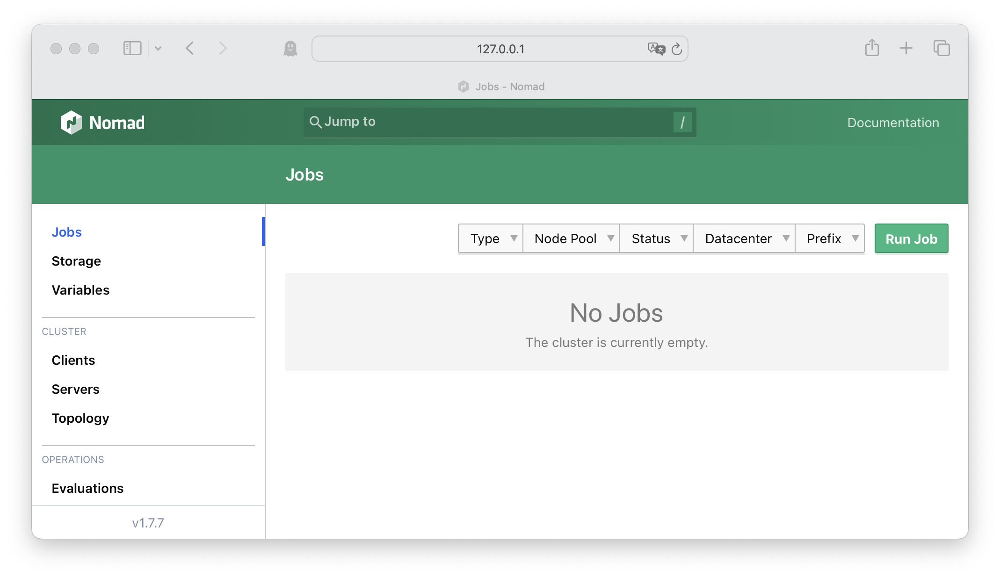

# gTTS - Nomad Job

- Python 3
- Nomad
- Linux/MacOS/Windows(WLS)

## 1. Nomad Dev Mode

Python3가 설치된 환경에서 Nomad를 실행합니다.
- Nomad Install 가이드 : <https://developer.hashicorp.com/nomad/install?product_intent=nomad>

```bash
nomad agent -dev
```

## 2. Web UI 확인

<http://localhost:4646>



## 3. Parameterized Job 실행

1. UI 좌측에서 `Jobs`를 선택합니다.
2. Job UI 화면에서 우측의 `Run Job` 버튼을 클릭합니다.
3. `gtts-param.hcl`의 내용을 복사하여 `Job Definition`에 붙여넣습니다.
4. 하단의 `Plan` 버튼을 클릭하고 문제가 없는지 확인합니다.
5. 실행 계획(dry-run)에 문제가 없으면 `Run` 버튼을 클릭하여 실행합니다.

### 3.1 데이터 입력하여 Dispatch 하기

1. 생성된 `gtts-param` Job을 클릭합니다. (Job을 생성하면 해당 Job 화면이 표시됩니다.)
2. `Job Launches`에 있는 `Dispatch Job`을 클릭합니다.
3. `Payload`에 문장을 기입합니다. (샘플은 `alloc/conversation.txt`에 있습니다.)
4. 기입이 완료되면 하단의 `Dispatch` 버튼을 클릭합니다.

### 3.2 실행 확인

1. `gtts-param` Job 화면에서 `Recent Allocations` 를 확인하여 실행중인 Job을 확인합니다.
2. 실행중인 Allocation의 ID를 클릭하여 Allocation 정보 화면으로 이동합니다.
3. `Task Lifecycle Status` 항목에서 `player` 단계가 실행중(녹색)임을 확인합니다.
4. 하단의 `Ports` 정보에서 `player`의 host address를 확인하고 클릭합니다.
5. player를 클릭하여 입력한 데이터가 음성으로 출력됨을 확인합니다.

## 4. Job 구조 설명

```hcl
job "gtts-param" { # Job 이름을 정의합니다.
  datacenters = ["dc1"]

  type = "batch" # 배치 작업 유형으로 실행됩니다.

  parameterized {
    # 배치 작업 에서 payload 값을 필수로 입력 받도록 구성합니다. payload는 음성데이터 변환을 위한 텍스트 데이터로 사용됩니다.
    payload       = "required" 
    meta_required = []
  }

  group "create-and-play" {

    network {
      port "player" {} # player에서 랜덥으로 할당 받는 NOMAD_PORT_player 환경변수가 생성됩니다.
    }

    task "create" {
      driver = "raw_exec"

      lifecycle {
        hook = "prestart"
        sidecar = false
      }

      config {
        command = "local/start.sh"
      }

      template {
        destination = "local/start.sh"
        data        = <<-EOF
        #!/bin/bash
        echo ${NOMAD_ALLOC_DIR}
        cd local/creator
        pip3 install -r requirements.txt --break-system-packages
        python3 main.py
        EOF
      }

      artifact {
        # 실행을 위한 python 코드를 다운 받는 url을 정의합니다.
        source      = "https://github.com/Great-Stone/nomad-param-gtts-demo/releases/download/0.1.4/creator.zip"
        destination = "local"
      }

      dispatch_payload {
        # payload 값이 저장되는 위치입니다. alloc은 동일 group내 모든 task가 공유하는 공간입니다.
        file = "../../alloc/conversation.txt"
      }

      resources {
        cpu    = 1
        memory = 256
      }
    }

    task "player" {
      driver = "raw_exec" # 외부 스크립트를 실행

      config {
        command = "local/start.sh"
      }

      env {
        MY_PORT = "${NOMAD_PORT_player}"
      }

      template {
        destination = "local/start.sh"
        data        = <<-EOF
        #!/bin/bash
        cd local/player
        pip3 install -r requirements.txt --break-system-packages
        python3 main.py
        EOF
      }

      artifact {
        # 실행을 위한 python 코드를 다운 받는 url을 정의합니다.
        source      = "https://github.com/Great-Stone/nomad-param-gtts-demo/releases/download/0.1.4/player.zip"
        destination = "local"
      }

      resources {
        cpu    = 1
        memory = 256
      }
    }
  }
}

```